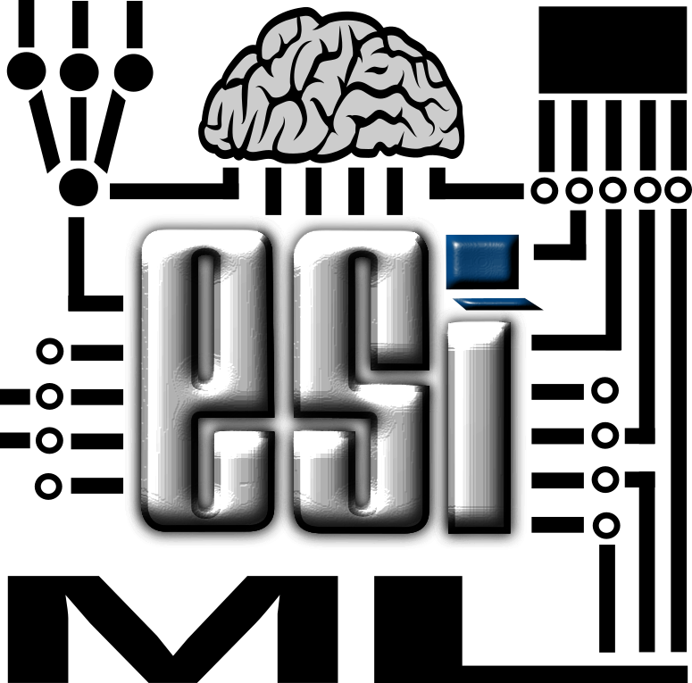

#  "Machine Learning" practicals

This repo contains some lectures and labs presented in "Machine Learning" designed for students of "école nationale supérieure d'informatique (ESI)", Algiers, Algeria.

[Download here](https://github.com/projeduc/ESI_2CS_ML/releases)

## Full lectures

- **Data preparation and models' evaluation**
    - Data collection
        - Data quality
        - Data integration
        - Data annotation
        - Data cleaning
    - Data transformation
        - Numerical features
        - Categorical features
        - Feature generation
    - Data sampling and splitting
        - Unbalanced data
        - Data splitting
        - Cross validation
    - Models' evaluation
        - Classification
        - Regression
        - Clustering
- **Naı̈ve Bayes and hidden Markov model**
    - Classification models
        - Non-tenporal problems
        - Temporal problems
        - Discriminative models
        - Generative models
    - Naı̈ve Bayes
        - Estimation
        - Prior probability
        - Likelihood
    - Numerical application
        - Multinomial NB
        - Bernoulli NB
        - Normal NB
        - HMM
- **Neural Networks**
    - Neuron
        - Network
        - Activation functions
        - Cost functions
        - Optimization functions
    - Feedforward Neural Networks (FFNN)
        - Multi-layers architecture
        - Auto-encoders
        - Convolutional Neural Network (CNN)
        - Regularization
    - Recurrent Neural Networks (RNN)
        - Architecture (RNN)
        - Long Short-Term Memory (LSTM)
        - Gated Recurrent Unit (GRU)
    - Attention
        - Attention mechanism
        - Multi-Head Attention
        - Self-attention
        - Transformer

## Lab supports

- **Multi-class and multi-label classification**
    - Classification
        - Binary classification
        - Multi-class classification
        - Multi-label classification
    - Binary logistic regression
        - Probability estimation
        - Cost and Gradient
        - Gradient (derivation)
        - Parameters' update
    - Multi-class logistic regression
        - One-vs-Rest
        - One-vs-One
        - Multinomial
    - Multi-label logistic regression
        - Binary relevance
        - Label powerset
- **Decision trees and Ensemble learning**
    - Decision trees
        - Algorithms
        - Stop conditions
        - Review
    - ID3
        - Homogeneity of a set
        - Set's split
        - Choice of split feature
        - Example
    - CART
        - Homogeneity of a set
        - Set's split
        - Choice of split feature
    - Random forests
        - Ensemble learning
        - Parameters of a Forest
- **Regularization and feature selection**
    - Regularization
        - L2 Loss
        - L1 Loss
        - ElasticNet
    - Feature selection
        - Filter
        - Embedded
        - Wrapper
- **Support vector machine (SVM)**
    - Problem definition
        - Hard-margin
        - Soft-margin
    - Primal form
        - Cost function
        - Class estimation
        - Optimization algorithms
    - Dual form
        - Cost function
        - Class estimation
        - Optimization algorithms

## License

Copyright (C) 2021-2024  Abdelkrime Aries

[Attribution 4.0 International (CC BY 4.0)](https://creativecommons.org/licenses/by/4.0/deed.en)

**You are free to:**
- **Share** — copy and redistribute the material in any medium or format
- **Adapt** — remix, transform, and build upon the material
for any purpose, even commercially.

**Under the following terms:**
- **Attribution** — You must give appropriate credit, provide a link to the license, and indicate if changes were made. You may do so in any reasonable manner, but not in any way that suggests the licensor endorses you or your use.
- **No additional restrictions** — You may not apply legal terms or technological measures that legally restrict others from doing anything the license permits.

